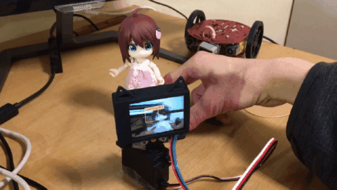

# rotation_camera(huskylens_arduino_playground)

Arduino UNO's GPIO connection

- 10：Software Serial RX to HUSKYLENS's TX
- 11：Software Serial TX to HUSKYLENS's RX

- A4：I2C SDA to PCA9685's SDA
- A5：I2C SCL to PCA9685's SCL
- 5V：Connect to HUSKYLENS's Power
- GND：Connect to HUSKYLENS's GND

#### Demo

See the official reference for a description of each module.
